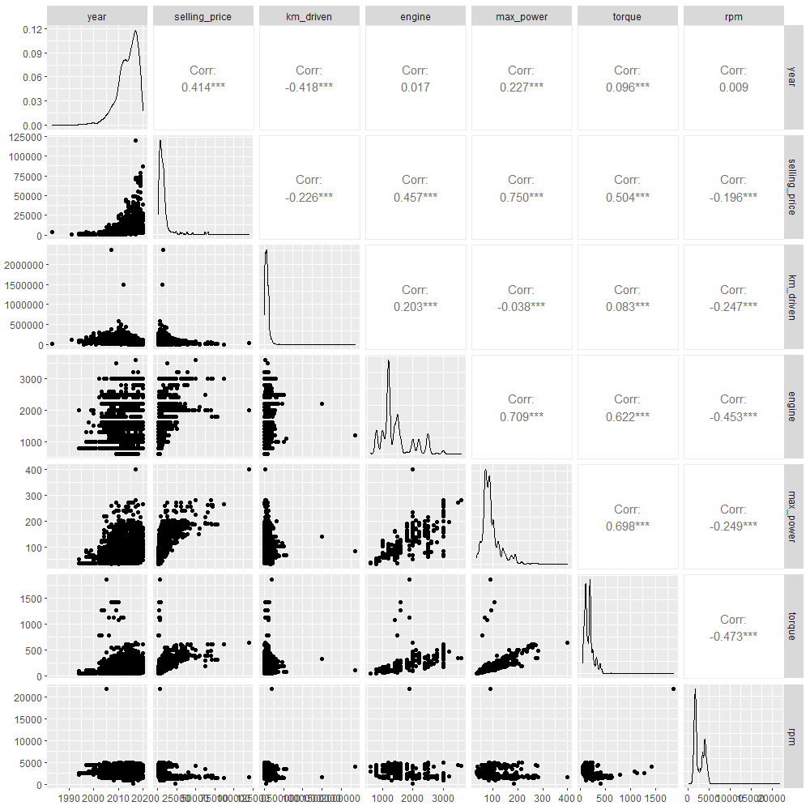

```{r echo=FALSE, warning=FALSE, include=FALSE}
library(knitr) #funzioni di rmarkdown
library(GGally) #ggpairs
library(ggplot2) #ggplot
library(moments) #skewness/kurtosis
library(scales) #rescale()
library(TTR) #analisi di mercato
```

# Introduzione al dataset

Il dataset in analisi, *"Car details v3.csv"*, è un file csv (comma separated values) scaricato da "<https://www.kaggle.com/datasets/nehalbirla/vehicle-dataset-from-cardekho>". La documentazione del dataset ci informa che esso contiene valori ottenuti tramite **web-scraping**, pertanto ci aspettiamo potenziali problemi su forma e correttezza dei dati. Importiamo il file per svolegere le prime **analisi esplorative**, poi osserviamo le prime colonne ed il loro contenuto:

```{r echo=F}
carsCSV <- read.csv("Car_details_v3.csv", header=TRUE)
```

```{r echo=F}
kable(carsCSV[1:3,])
```

Struttura dei dati:

```{r}
str(carsCSV)
```

In merito alle 13 variabili, notiamo subito che:

**"name"** contiene due valori utili, la marca dell'auto (fattorizzabile) ed il modello specifico.

**"selling_price"** è in Rupie Indiane (INR), confermato dalla documentazione del Dataset.

**"mileage"** ha diverse unità di misura (in relazione a "fuel")

**"torque"** contiene sia i valori di coppia sia i giri motore in cui tale coppia viene sviluppata, ma raccolti in modo estremamente eterogeneo.

È pertanto necessaria una estensiva pulizia dei dati, generiamo pertanto il data frame "cleanedCSV":

# Pulizia dei dati

```{r}
if (! file.exists("cleanedCSV.csv")) {
  source("clean_csv.R") #pulizia delle singole variabili e creazione di cleanedCSV.csv
  rm(list=ls())
}
#import e fattorizzazione del nuovo file
cleanedCSV <- read.csv("cleanedCSV.csv", header=TRUE)
cleanedCSV$brand <- factor(cleanedCSV$brand)
cleanedCSV$fuel <- factor(cleanedCSV$fuel)
cleanedCSV$seller_type <- factor(cleanedCSV$seller_type)
cleanedCSV$transmission <- factor(cleanedCSV$transmission)
cleanedCSV$owner <- factor(cleanedCSV$owner)
cleanedCSV$owner <- factor( # ordinamento dei livelli
  cleanedCSV$owner, levels=c(
    "First Owner", "Second Owner", "Third Owner", "Fourth & Above Owner", "Test Drive Car")
)
cleanedCSV$seats <- factor(cleanedCSV$seats)
cleanedNA <- na.omit(cleanedCSV) #creazione in memoria del DF di lavoro, senza i valori NA.
```

*seguono degli estratti significativi del processo di pulizia:*

**"name"**: sempre nel formato "car_brand model", dove car_brand è fattorizzabile: estratta la prima sottostringa (brand), salvata in una colonna a parte e poi sottratta dal name originale;

**"selling_price"**: la differente valuta rende meno immediata la lettura dei grafici, pertanto abbiamo convertito i prezzi in EUR al cambio del 2020 (1 INR = 0.0118 EUR);

**"mileage"**: rimossa l'unità di misura, facilmente ricavabile da "fuel": km/l per benzina e diesel, km/kg per GPL e metano;

**"engine"**: qui è stata svolta una trasformazione dei dati, la cilindrata è stata arrotondata ai valori di marketing: ai fini della ricerca su trend di mercato la differenza tra un motore 1297CC ed un 1298CC non è rilevante, sono entrambe classificate e vendute come "1.3";

**"max_power"**: rimossa l'unità di misura (tutte omogenee);

**"brand", "fuel", "seller_type", "transmission", "owner", "seats"**: fattorizzate così com'erano;

**"torque"**: la più eterogenea, espressa in più di 40 modi diversi. Le stringhe sono state manipolate tramite rimozioni successive dei caratteri inutili tramite gsub, sub e l'uso di regexpr. Successivamente è stata uniformata la unità di misura convertendo tutti i valori presenti in kg/m in Nm (la più frequente). Nel caso di UdM non specificata giudicando l'ordine di grandezza dei valori è stato scelto il Nm. In caso fossero presenti entrambe, è stato scelto il Nm per uniformità.

*nota bene: tutte le variabili sono state controllate, uniformando eventuali stringhe vuote e valori mancanti con NA.*

```{r}
   unique(gsub('[[:digit:]]','_' ,carsCSV$torque)) #modi in cui è espresso "torque" nel csv originale:
```

**Il dataframe pulito:**

```{r echo=F}
kable(cleanedCSV[1:3,])
```

# Analisi esplorativa

#### **"brand"**

```{r echo=FALSE}
ggplot(cleanedCSV, aes(x=brand, fill=brand)) + geom_bar() + coord_flip() + theme(legend.position="none") + scale_fill_hue(c = 15)
#tabella
sort(prop.table(table(cleanedCSV$brand))*100, decreasing = TRUE)
```

Il mercato osservato è dominato da tre brand principali: **"Maruti"**, **"Hyundai"** e **"Mahindra"**, che insieme superano il 50% delle auto in vendita.

#### **"owner"**

```{r echo=FALSE}
ggplot(cleanedCSV, aes(x=owner, fill=owner)) + geom_bar() + theme(legend.position="none") + scale_fill_hue(c = 15)
prop.table(table(cleanedCSV$owner))*100

```

La maggior parte (\~65%) delle auto nel campione sono vendute come seconda mano (l'inserzione è stata creata dal "First Owner")

#### **"fuel"**

```{r echo=FALSE}
ggplot(cleanedCSV, aes(x=fuel, fill=fuel)) + geom_bar() + theme(legend.position="none") + scale_fill_hue(c = 15)
prop.table(table(cleanedCSV$fuel))*100
```

La quantità di auto a GPL o Gas Naturale presenti sulla piattaforma è estremamente ridotta, hanno una presenza combinata minore del 1,2% (\<100 modelli)

#### **"seller_type"**

```{r echo=FALSE}
ggplot(cleanedCSV, aes(x=seller_type, fill=seller_type)) + geom_bar() + theme(legend.position="none") + scale_fill_hue(c = 15)
prop.table(table(cleanedCSV$seller_type))*100
```

La maggior parte degli utenti della piattaforma (\>83%) sono privati, il \~14% sono concessionarie mentre le piattaforme di usato certificato sono inferiori al 3%.

#### **"year"**

```{r echo=FALSE}
ggplot(cleanedCSV, aes(x=year)) + geom_density()
prop.table(table(cleanedCSV$year))*100

```

Il dataset è del 2020, quindi lo \~0,9% di densità delle auto del 2020 è giustificato. Dalla distribuzione così asimmetrica verso destra possiamo supporre che gli utenti di questo servizio di vendita siano più interessati a vender auto moderne rispetto alle auto d'epoca, infatti il picco di auto vendute (\~12.5%) è nel 2017, ergo molto recenti.

#### **"selling_price"**

# Confronto con modello teorico

```{r echo=F}
#originale
ggplot(cleanedNA, aes(x=selling_price)) + geom_density(color="red") + ggtitle('Densità di selling_price')
```

Decidiamo di applicare la funzione log10 sui valori di selling_price per concentrare l'analisi sulle fasce di prezzo.

```{r echo=F}
ggplot(cleanedNA, aes(x=log10(selling_price))) + geom_density(color="blue") + ggtitle('Densità log di selling_price')
```

vista la forma a campana, proviamo a confrontare la variabile "selling_price" in scala logaritmica con un il modello teorico della Gaussiana.

```{r echo=F}
# price e' una gaussiana?
log_price_scaled <- rescale(log(cleanedNA$selling_price))
avg_pr <- mean(log_price_scaled)
sd_pr <- sd(log_price_scaled)
# confrontiamo con f. ripart. di gaussiana
#par(mfrow=c(1,3))
plot(ecdf(log_price_scaled), main="funzione di ripartizione empirica")
curve(pnorm(x, avg_pr, sd_pr), col="red", add=T)
# confrontiamo ora le densita
dens <- density(log_price_scaled)
curve(dnorm(x, avg_pr, sd_pr), col="red", main="Confronto gaussiana con parametri empirici / log10(selling_price)", ylim=range(0,max(dens$y)), ylab="density", xlab="price (scaled)" )
lines(dens)
#le qqlines
qqnorm(log_price_scaled)
qqline(log_price_scaled)
```

Come possiamo notare dal grafico qqnorm, la densità di selling_price si discosta maggiormente dalla qqline nella parte destra. Questo ci suggerisce che la coda destra della densità della nostra variabile sia più pesante rispetto ad una Normale. Per confermare questa nostra osservazione effettuiamo un analisi della curtosi e della simmetria utlizzando il package moments.

```{r}
curt <- kurtosis(log(cleanedNA$selling_price))
simm <- skewness(log(cleanedNA$selling_price))

print(paste("Curtosi: ",curt))
print(paste("Simmetria: ",simm))
```

L'indice K (curtosi) positivo indica una forma più "appuntita" del grafico rispetto ad una Normale; L'indice di Pearson (skewness) leggermente positivo indica una asimmetria verso destra, il grafico infatti sul lato sinistro coincide meglio.

```{r,  echo=FALSE}

# to_sel = c("year", "selling_price", "km_driven", "engine", "max_power", "torque", "rpm")
# ggpairs(subset(cleanedCSV, select=to_sel)) ##todo togliere labels
```

# Analisi Bivariata



*Il procedimento per il confronto di variabili come "km_driven" o "max_power" ed il modello teorico della normale è il medesimo di quello precedentemente svolto per "selling_price"*.

Notiamo come ci sono correlazioni molto significative (***r\>0.5***) che hanno riscontri nella relatà, ad esempio "max_power" e "selling price" (auto potenti tendono a costare di più), oppure "engine" e "torque" (auto con alta cilindrata tendono ad avere molta coppia).

Confrontiamo le distribuzioni per tipologia di carburante:

```{r echo=FALSE}
plot_price_fuel <- function(df, k=1){
  values <- c();
  m_height <- c();
  m_width  <- c();
  for( f in unique(df$fuel) ){
    value <- density(df$selling_price[df$fuel==f]);
    values <- c(values, value);
    m_height <- c(m_height, max(value$y));
    m_width <- c(m_width, max(value$x));
  }
  m_height <- max(m_height);
  m_width <- max(m_width);

  plot(x=NULL, y=NULL, xlim=range(0,m_width/k), ylim=range(0,m_height), ylab="density", xlab="price");
  lines(density(df$selling_price[df$fuel=="Petrol"]), col="#008507");
  lines(density(df$selling_price[df$fuel=="Diesel"]), col="red");
  lines(density(df$selling_price[df$fuel=="LPG"]), col="blue");
  lines(density(df$selling_price[df$fuel=="CNG"]), col="orange");
  legend("topright", legend=c("LPG","CNG","Petrol","Diesel"), pch=16, col=c("blue","orange","#008507","red") );
}

plot_price_fuel(cleanedCSV, k=4)
```

*Il grafico è zoomato sul primo quarto dei dati* notiamo come la maggioranza di auto economiche sia alimentata a GPL o Gas Metano, mentre questi gruppi spariscono superati (rispettivamente) i 6000€ e gli 8000€. Diesel e benzina invece sono presenti in ogni fascia di prezzo.

```{r echo=F}


# (seller_type dipende da owner?). es: se sono il primo proprietario la faccio rivendere ad un concessionario?
#table(cleanedCSV$owner, cleanedCSV$seller_type)
prop.table(table(cleanedCSV$owner, cleanedCSV$seller_type), margin=2)*100 # i firstOwner vanno dal dealer "piu spesso" che i secondOwner

```

Dalla tabella di "owner" condizionato a "seller type", si nota come i concessionari tendano a non vendere auto sopra la terza mano.

```{r echo=F}

# TODO CAPIRE CONCLUIOSNI, test
#table(cleanedCSV$transmission, cleanedCSV$seller_type)
#prop.table(table(cleanedCSV$transmission, cleanedCSV$seller_type), margin=1)*100
prop.table(table(cleanedCSV$transmission, cleanedCSV$owner), margin=1)*100
```

Le auto automatiche in vendita sono recenti come storico proprietari, ovvero hanno avuto pochi proprietari. "manual" segue lo stesso trend, ma in misura meno marcata.

```{r echo=F}


# selling_price basato su seller_type
boxplot(log10(selling_price)~seller_type, data=cleanedCSV, outline=FALSE, ylab = "selling_price (log10)")

```

Da questo grafico si evince come le auto in vendita presso i concessionari costino mediamente di più rispetto a quelle vendute dai privati. Persino l'usato "trusted" (cioè affiliato al servizio di vendita) ha un leggero sovrapprezzo rispetto alla vendita individuale.

```{r echo=F}


# selling_price basato su transmission
boxplot(log10(selling_price)~transmission, data=cleanedCSV, outline=FALSE, ylab = "selling_price (log10)")

```

Questo boxplot mostra come le auto automatiche abbiano un prezzo più alto rispetto alle auto manuali.

```{r echo=F}


# rpm basati sul fuel
boxplot(rpm~fuel, data=cleanedCSV, outline=FALSE)

```

Questo grafico conferma che i motori diesel, data la loro intrinseca caratteristica di essere più pesanti e robusti a causa dell'elevatissima pressione necessaria al funzionamento, abbiano un range di coppia ottimale più basso rispetto alle controparti a gas e benzina, che avendo componenti (pistoni, bielle, volano ecc.) più leggere riescono ad operare a giri più alti.

# Analisi di mercato

#### Quali case automobilistiche sono maggiormente uniformate ai trend di mercato?

```{r, echo=FALSE}
df<-cleanedNA
aumento_medio <- function(lista){
  aumenti <- c();
  # Calcola gli incrementi tra un valore ed il successivo
  for( i in 1:length(lista)-1 ){
    aumenti <- c(aumenti, (lista[i+1]/lista[1])-1 );
  }
  # Calcola la media tra tutti gli incrementi
  aumento <- mean(aumenti);
  return(aumento)
}


# Tipo di cambio
transmission_fun <- function(df,show=FALSE){
  # Calcola la suddivisione di mercato tra automatiche e manuali per ogni anno
  table_transmission <- 100*prop.table(table(df$transmission,df$year),2);
  if(show){
    barplot(table_transmission)
  }
  return(table_transmission);
}

# Cilindrata
means_engine_fun <- function(df,show=FALSE){
  # Calcola la media per ogni anno
  means_engine <- aggregate(df$engine,unique(list(df$year)),mean)
  colnames(means_engine) <- c("year","engine")
  # Calcola la media mobile semplice delle medie precedenti
  means_engine$engine_SMA <- SMA(means_engine$engine,n=3)
  # Calcola l'incremento medio tra un anno ed il successivo
  avg_change_engine <- aumento_medio(means_engine$engine_SMA[!is.na(means_engine$engine_SMA)]);
  if(show){
    plot(data=means_engine, engine_SMA~year , xlab="Anno", ylab="Cilindrata")
  }
  res <- list(
    "avg_change" = avg_change_engine,
    "means" = means_engine
  )
  return(res);
}
# Consumo di carburante
means_mileage_fun <- function(df_l,show=FALSE){
  # Calcola la media per ogni anno nel caso di carburante diesel o benzina rispettivamente
  means_mileage_Diesel <- aggregate( df_l$mileage[df_l$fuel=="Diesel"]  ,list(df_l$year[df_l$fuel=="Diesel"]) ,mean, na.action= na.omit)
  means_mileage_Petrol <- aggregate( df_l$mileage[df_l$fuel=="Petrol"]  ,list(df_l$year[df_l$fuel=="Petrol"]) ,mean, na.action= na.omit)
  colnames(means_mileage_Diesel)  <- c("year","mileage")
  colnames(means_mileage_Petrol)  <- c("year","mileage")
  # Calcola la media mobile semplice
  means_mileage_Diesel$mileage_SMA  <- SMA( means_mileage_Diesel$mileage ,n=2)
  means_mileage_Petrol$mileage_SMA  <- SMA( means_mileage_Petrol$mileage ,n=2)
  # Calcola l'incremento medio 
  avg_change_mileage_Diesel  <- aumento_medio( means_mileage_Diesel$mileage_SMA[!is.na(means_mileage_Diesel$mileage_SMA)] );
  avg_change_mileage_Petrol  <- aumento_medio( means_mileage_Petrol$mileage_SMA[!is.na(means_mileage_Petrol$mileage_SMA)] );
  
  if(show){
    par(mfrow=c(1,2))
    plot( data=means_mileage_Diesel , mileage_SMA~year , xlab="Anno", ylab="Consumo", main="Diesel" , sub=paste("Aumento medio: ",round(100*avg_change_mileage_Diesel ,1),"%") )
    plot( data=means_mileage_Petrol , mileage_SMA~year , xlab="Anno", ylab="Consumo", main="Petrol" , sub=paste("Aumento medio: ",round(100*avg_change_mileage_Petrol ,1),"%") )
  }
  means_mileage <- list(
    "Diesel" = means_mileage_Diesel,
    "Petrol" = means_mileage_Petrol
  )
  avg_change_mileage <- list(
    "Diesel" = avg_change_mileage_Diesel,
    "Petrol" = avg_change_mileage_Petrol
  )
  res <- list(
    "avg_change" = avg_change_mileage,
    "means" = means_mileage
  )
  return(res);
}

# Coppia
means_torque_fun <- function(df,show=FALSE){
  # Calcola la media per ogni anno
  means_torque <- aggregate(df$torque,unique(list(df$year)),mean)
  colnames(means_torque) <- c("year","torque");
  # Calcola la media mobile semplice delle medie precedenti
  means_torque$torque_SMA <- SMA(means_torque$torque,n=3)
  # Calcola l'incremento medio tra un anno ed il successivo
  avg_change_torque <- aumento_medio(means_torque$torque_SMA[!is.na(means_torque$torque_SMA)]);
  if(show){
    plot(data=means_torque, torque_SMA~year , xlab="Anno", ylab="Coppia")  
  }
  res <- list(
    "avg_change" = avg_change_torque,
    "means" = means_torque
  )
  return(res);
}
# Potenza
means_max_power_fun <- function(df,show=FALSE){
  # Calcola la media per ogni anno
  means_max_power <- aggregate(df$max_power,list(df$year),mean)
  colnames(means_max_power) <- c("year","max_power");
  # Calcola la media mobile semplice delle medie precedenti
  means_max_power$max_power_SMA <- SMA(means_max_power$max_power,n=3)
  # Calcola l'incremento medio tra un anno ed il successivo
  avg_change_max_power <- aumento_medio(means_max_power$max_power_SMA[!is.na(means_max_power$max_power_SMA)]);
  if(show){
    plot(data=means_max_power, max_power_SMA~year , xlab="Anno", ylab="Potenza")  
  }
  res <- list(
    "avg_change" = avg_change_max_power,
    "means" = means_max_power
  )
  return(res);
}
```

```{r echo=FALSE}
brands <- unique(df$brand)
cars_n <- c();
for(brand in brands){
  L <- length(df$brand[df$brand==brand])
  cars_n <- c(cars_n,L)
}
df_new <- data.frame('brand'=brands,'cars'=cars_n)
df_new <- df_new[order(df_new$cars,decreasing=T),]
```

Iniziamo osservando lo share di mercato individuale e cumulativo dei vari marchi:

```{r echo = FALSE}
df_new$share <- 100 * df_new$cars/sum(df_new$cars)
df_new$cumulative_share <- cumsum(df_new$share)
print(df_new)
```

Scegliamo di considerare i primi sei marchi in quanti essi costituiscono (cumulativamente) più del 75% del mercato totale, e di analizzare le variabili "engine", "mileage" e "max_power".

```{r echo = FALSE}
brands <- as.vector(head( df_new , n=6 )$brand)

res <- list()
for(brand in brands){
  res[[brand]] <- list(
    "transmission" = transmission_fun(df[df$brand==brand,]),
    "engine" = means_engine_fun(df[df$brand==brand,]),
    "mileage" = means_mileage_fun(df[df$brand==brand,]),
    "max_power" = means_max_power_fun(df[df$brand==brand,])
  )
}

res[['Market']] <- list(
  "transmission" = transmission_fun(df),
  "engine" = means_engine_fun(df),
  "mileage" = means_mileage_fun(df),
  "max_power" = means_max_power_fun(df)
)
```

Lo scopo di questa analisi è verificare l'influenza del brand maggiore sul trend di mercato, e confrontare i primi sei brand con l'andamento generale. Tutti i dati sono ottenuti tramite media mobile semplice (SMA), per il lisciamento delle curve. Dal momento che il primo marchio costituisce il 30% del mercato, ci aspettiamo che i suoi trend siano simili a quelli del mercato totale.

#### Cilindrata

```{r echo = FALSE}

# engine
plot( data=res$Market$engine$means,   engine_SMA~year , xlab = "Anno", ylab = "Cilindrata", main="Mercato totale - Cilindrata" )

par(mfrow=c(2,3))
plot( data=res$Maruti$engine$means,   engine_SMA~year , xlab = "Anno", ylab = "Cilindrata", main="Maruti")
plot( data=res$Hyundai$engine$means,  engine_SMA~year , xlab = "Anno", ylab = "Cilindrata", main="Hyundai")
plot( data=res$Mahindra$engine$means, engine_SMA~year , xlab = "Anno", ylab = "Cilindrata", main="Mahindra")
plot( data=res$Tata$engine$means,     engine_SMA~year , xlab = "Anno", ylab = "Cilindrata", main="Tata")
plot( data=res$Honda$engine$means,    engine_SMA~year , xlab = "Anno", ylab = "Cilindrata", main="Honda")
plot( data=res$Toyota$engine$means,   engine_SMA~year , xlab = "Anno", ylab = "Cilindrata", main="Toyota")
```

Notiamo subito che il grafico del mercato totale e quello di "Maruti" sono molto simili, ciò si ripete per tutte le variabili in analisi.

#### Efficienza (Diesel):

*Nota: non sono state considerate, nell'analisi dei consumi, le automobili alimentate a GPL o a Gas Naturale, in quanto non esiste, per marca, un campione statistico sufficiente ad effettuare un'analisi accurata.*

```{r echo = FALSE}
# mileage diesel
par(mfrow=c(1,1))
plot( data=res$Market$mileage$means$Diesel,   mileage_SMA~year , xlab = "Anno", ylab = "Efficienza", main='Mercato totale - Efficienza ("km/l")' )

par(mfrow=c(2,3))
plot( data=res$Maruti$mileage$means$Diesel,   mileage_SMA~year , xlab = "Anno", ylab = "Efficienza", 
main="Maruti")
plot( data=res$Hyundai$mileage$means$Diesel,  mileage_SMA~year , xlab = "Anno", ylab = "Efficienza", main="Hyundai")
plot( data=res$Mahindra$mileage$means$Diesel, mileage_SMA~year , xlab = "Anno", ylab = "Efficienza", main="Mahindra")
plot( data=res$Tata$mileage$means$Diesel,     mileage_SMA~year , xlab = "Anno", ylab = "Efficienza", 
main="Tata")
plot( data=res$Honda$mileage$means$Diesel,    mileage_SMA~year , xlab = "Anno", ylab = "Efficienza", 
  main="Honda")
plot( data=res$Toyota$mileage$means$Diesel,   mileage_SMA~year , xlab = "Anno", ylab = "Efficienza", 
main="Toyota")
```

#### Efficienza (Petrol):

```{r echo = FALSE}
# mileage benzina
par(mfrow=c(1,1))
plot( data=res$Market$mileage$means$Petrol,   mileage_SMA~year , xlab = "Anno", ylab = "Efficienza", main='Mercato totale - Efficienza (km/l)' )

par(mfrow=c(2,3))
plot( data=res$Maruti$mileage$means$Petrol,   mileage_SMA~year , xlab = "Anno", ylab = "Efficienza", 
main="Maruti")
plot( data=res$Hyundai$mileage$means$Petrol,  mileage_SMA~year , xlab = "Anno", ylab = "Efficienza", main="Hyundai")
plot( data=res$Mahindra$mileage$means$Petrol, mileage_SMA~year , xlab = "Anno", ylab = "Efficienza", main="Mahindra")
plot( data=res$Tata$mileage$means$Petrol,     mileage_SMA~year , xlab = "Anno", ylab = "Efficienza", 
main="Tata")
plot( data=res$Honda$mileage$means$Petrol,    mileage_SMA~year , xlab = "Anno", ylab = "Efficienza", 
  main="Honda")
plot( data=res$Toyota$mileage$means$Petrol,   mileage_SMA~year , xlab = "Anno", ylab = "Efficienza", 
main="Toyota")
```

#### Potenza:

```{r echo = FALSE}
# potenza 
par(mfrow=c(1,1))
plot( data=res$Market$max_power$means,   max_power_SMA~year , xlab = "Anno", ylab = "Potenza", main='Mercato totale - Potenza (bhp)' )

par(mfrow=c(2,3))
plot( data=res$Maruti$max_power$means,   max_power_SMA~year , xlab = "Anno", ylab = "Potenza", 
main="Maruti")
plot( data=res$Hyundai$max_power$means,  max_power_SMA~year , xlab = "Anno", ylab = "Potenza", main="Hyundai")
plot( data=res$Mahindra$max_power$means, max_power_SMA~year , xlab = "Anno", ylab = "Potenza", main="Mahindra")
plot( data=res$Tata$max_power$means,     max_power_SMA~year , xlab = "Anno", ylab = "Potenza", 
main="Tata")
plot( data=res$Honda$max_power$means,    max_power_SMA~year , xlab = "Anno", ylab = "Potenza", 
  main="Honda")
plot( data=res$Toyota$max_power$means,   max_power_SMA~year , xlab = "Anno", ylab = "Potenza", 
main="Toyota")

```

#### Cambio:

```{r, echo=FALSE}
  #transmission
  barplot( res$Market$transmission ,col=c('#ff9580','#dbeaff'), main="Mercato totale", xlab="Anno", ylab="Percentuale di mercato", legend=TRUE)
 
  par(mfrow=c(2,3))
  barplot( res$Maruti$transmission ,col=c('#ff9580','#dbeaff'), main="Maruti", xlab="Anno", ylab="Percentuale di mercato", legend=TRUE)
  barplot( res$Hyundai$transmission ,col=c('#ff9580','#dbeaff'), main="Hyundai", xlab="Anno", ylab="Percentuale di mercato", legend=TRUE)
  barplot( res$Mahindra$transmission ,col=c('#ff9580','#dbeaff'), main="Mahindra", xlab="Anno", ylab="Percentuale di mercato", legend=TRUE)
  barplot( res$Tata$transmission ,col=c('#ff9580','#dbeaff'), main="Tata", xlab="Anno", ylab="Percentuale di mercato", legend=TRUE)
  barplot( res$Honda$transmission ,col=c('#ff9580','#dbeaff'), main="Honda", xlab="Anno", ylab="Percentuale di mercato", legend=TRUE)
  barplot( res$Toyota$transmission ,col=c('#ff9580','#dbeaff'), main="Toyota", xlab="Anno", ylab="Percentuale di mercato", legend=TRUE)
```

# Modelli lineari

In questa sezione proveremo a creare dei modelli lineari per la previsione di valori futuri, basandoci sui dati esistenti.

#### Modello lineare per "torque"

Proviamo a sviluppare un modello lineare per la coppia:

```{r echo=FALSE}
mod1_torque <- lm(data=cleanedNA, torque~max_power)
summary(mod1_torque)
```

Il p-value è estremamente basso, pertanto la probabilità che la correlazione sia casuale è molto bassa.

Guardiamo quanto il modello sia vicino ai punti:

```{r echo=FALSE}
plot(cleanedNA$max_power, cleanedNA$torque, xlab="max_power (bhp)", ylab="torque (Nm)")
abline(mod1_torque[1], mod1_torque[2], col="red")
```

Ora vediamo se possiamo migliorare il modello facendo i test dei residui:

```{r echo=FALSE}
par(mfrow=c(1,2))
plot(cleanedNA$engine, mod1_torque$residuals, ylim=range(-500, 500), xlab="engine (CC)", ylab="residuals")
abline(0, 0, col="red")
plot(cleanedNA$fuel, mod1_torque$residuals, outline=FALSE, xlab="fuel", ylab="residuals")
```

Il modello è migliorabile in quanto gli errori (residui) dipendono dalle variabili "fuel" ed "engine".

```{r}
mod2_torque <- lm(data=cleanedNA, torque~max_power+engine+fuel)
summary(mod2_torque)
```

Il modello di torque condizionato da max_power, engine e fuel continua ad avere dei p-values molto bassi, ma il coefficiente di determinazione è salito da 0.47 a 0.61, ergo il nostro modello è migliorato.

#### Proviamo ora a sviluppare un modello per la previsione dei prezzi

```{r}
mod1_price <- lm(data=cleanedNA, selling_price~max_power)
summary(mod1_price)
```

I p-values sono buoni, ma vogliamo ancora migliorare l'r-squared. "selling_price" è influenzato dalla maggior parte delle variabili, prendiamo per esempio i test dei residui effettuati con "torque", "km_driven", "brand", ed "year".

```{r}
par(mfrow=c(2,2))
plot(cleanedNA$torque, mod1_price$residuals, xlim=range(0, 800))
abline(0, 0, col="red")
plot(log10(cleanedNA$km_driven), mod1_price$residuals)
abline(0, 0, col="red")
plot(cleanedNA$brand, mod1_price$residuals)
abline(0, 0, col="red")
plot(cleanedNA$year, mod1_price$residuals)
abline(0, 0, col="red")
```

Ora generiamo il modello con tutte le variabili:

```{r}
mod2_price <- lm(selling_price~max_power+year+km_driven+mileage+rpm+brand+transmission+owner+engine+rpm+torque, data=cleanedCSV)
summary(mod2_price)
```

Il modello è soddisfacente (p-values molto bassi e R-squared a 0.84). Tuttavia il modello è complesso, per predirre il prezzo dovremmo essere a conoscenza di altri 11 dati: perciò cerchiamo di semplificarlo, rimuovendo variabili senza diminuire troppo il coefficente di determinazione (R\^2).

```{r}
mod3_price <- lm(selling_price~year+max_power+brand, data=cleanedCSV)
summary(mod3_price)$adj.r.squared
```

Osserviamo che questo modello, che determina selling_price partendo da anno, potenza e marca dell'auto ha un coefficente accettabile.

Proviamo dunque a prevedere il prezzo di alcuni modelli dell'anno seguente:

```{r}
year <- rep(2021, 5)
max_power <- c(70, 98, 120, 82, 100)
brand <- c("Maruti", "BMW", "BMW", "Fiat", "Volvo")
to_predict <- data.frame(year, max_power, brand)
rownames(to_predict) <- paste(brand, max_power, "bhp")
predict(mod3_price, to_predict)
```
